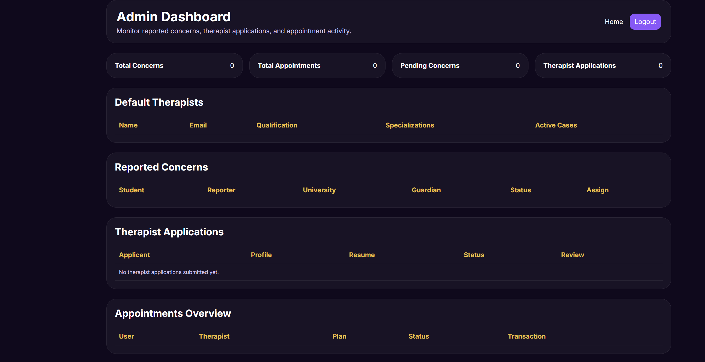
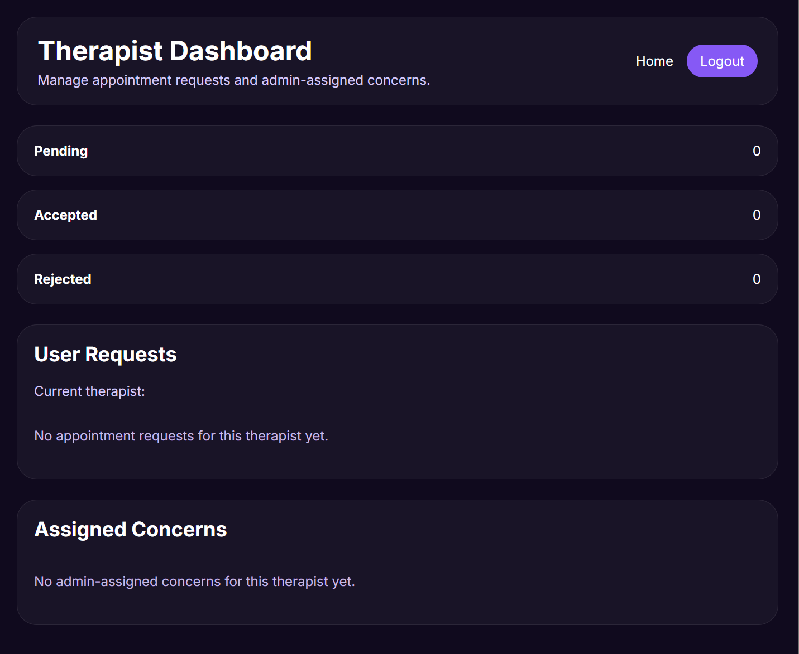
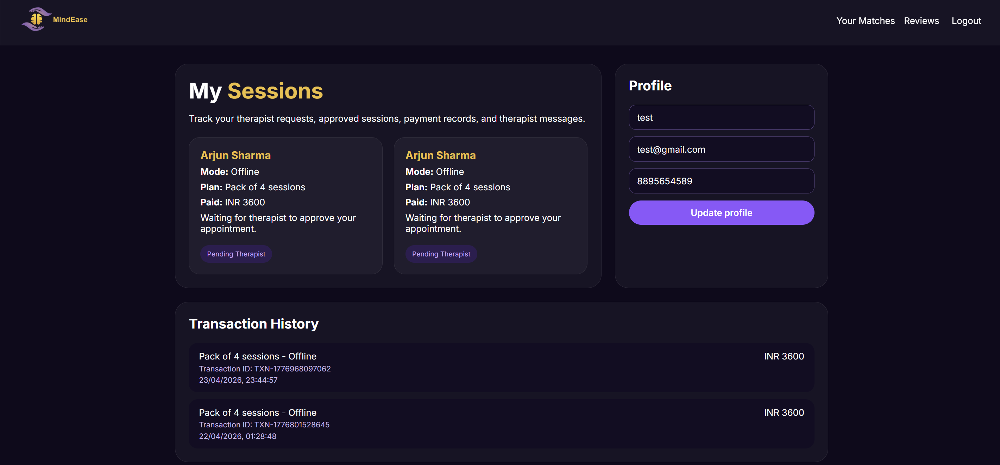
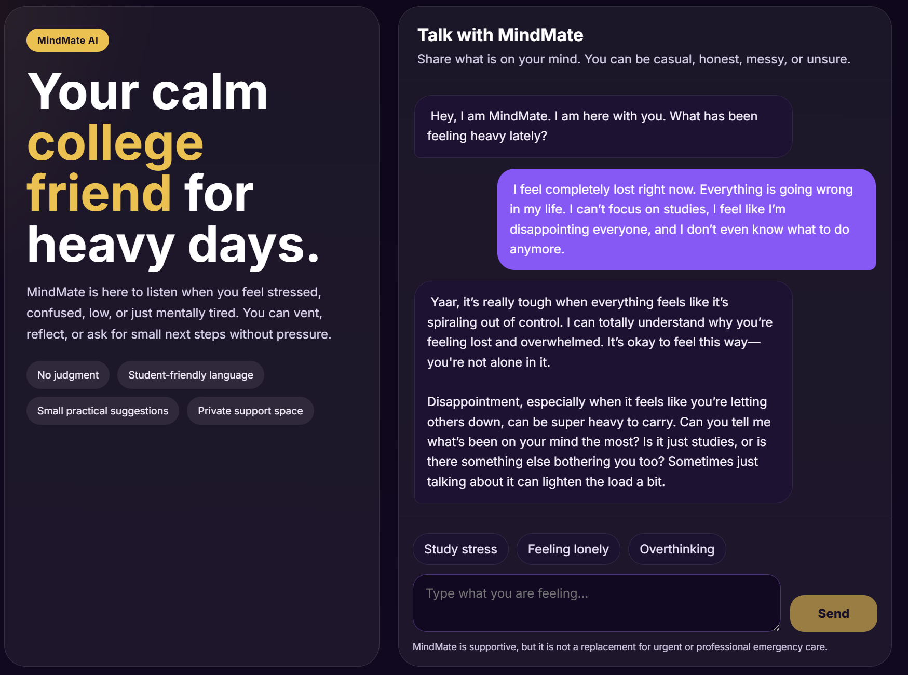
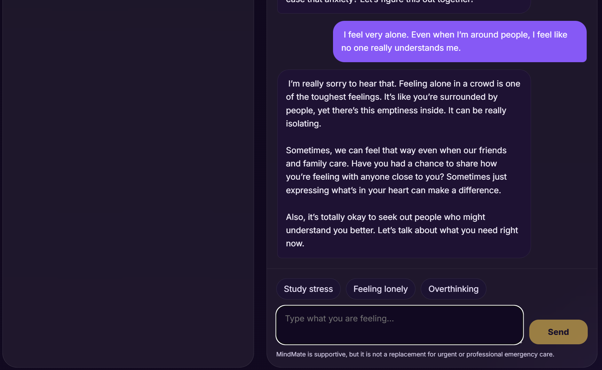
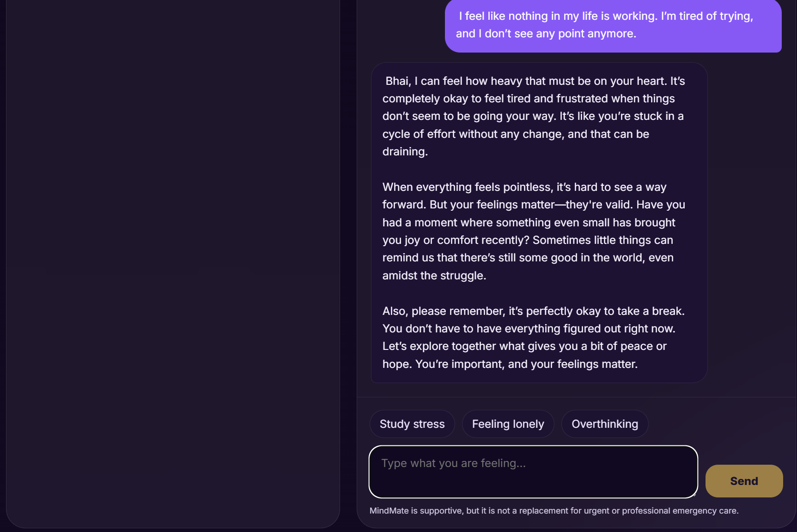
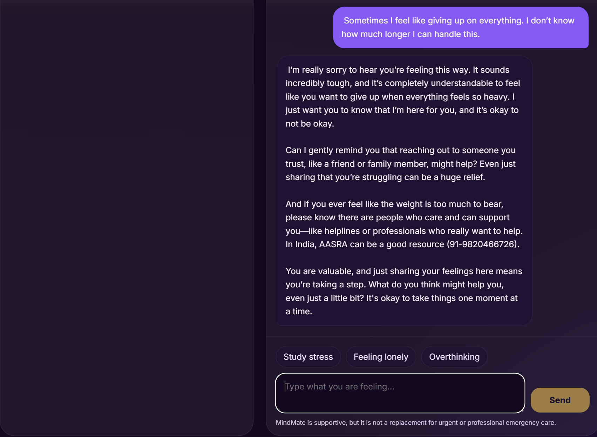

# MindEase 

MindEase is a full-stack AI-powered mental wellness platform designed for college students. It provides therapist booking, anonymous concern reporting, and an intelligent chatbot (MindMate) for emotional support.

---

## Live Demo

Website: https://mindease-as.netlify.app

Note: Admin access is restricted and not publicly available.

---

## Project Structure

* **backend/** – Node.js + Express API

  * Authentication, booking system, admin/therapist features
  * AI chatbot integration (MindMate)

* **frontend/** – Angular application

  * User interface, dashboards, booking system, chatbot UI

---

## Features

* User Authentication (JWT-based)
* Anonymous Concern Reporting System
* AI Chatbot (MindMate)
* User Dashboard (track sessions and view recent transactions)
* Therapist Dashboard (accept/reject requests)
* Admin Dashboard (assign/manage concerns and manage therapists)
* Appointment Booking System
* Transaction & Activity Tracking
* Real-time updates using polling

---

## Tech Stack

* **Frontend:** Angular
* **Backend:** Node.js, Express.js
* **Database:** MongoDB Atlas
* **AI:** OpenAI API

---

## Environment Setup

Create a `.env` file inside `backend/`:

```
MONGODB_URI=your_mongodb_connection_string
OPENAI_API_KEY=your_openai_api_key
JWT_SECRET=your_secret_key
```

---

## Installation & Running Locally

```
npm install
npm --prefix backend install
npm --prefix frontend install
```

Run:

```
npm run dev
```

---

## Local URLs

* Frontend: http://localhost:4200
* Backend: http://localhost:5000

---

## MindMate (AI Chat)

MindMate is an AI-powered assistant that provides:

* Emotional support conversations
* Hinglish/English adaptive responses
* Context-aware replies
* Safe fallback handling

---

## Screenshots

### Admin Dashboard


---

### Therapist Dashboard


---

### User Dashboard


---

### MindMate AI Chat


---

### AI Support Response




---


## Security Notes

* Sensitive credentials are not exposed in the frontend
* API keys are securely stored in environment variables
* Role-based access control implemented for admin and therapist

---

## Author

Abhishek Sharma
B.Tech CSE (Big Data Analytics)

